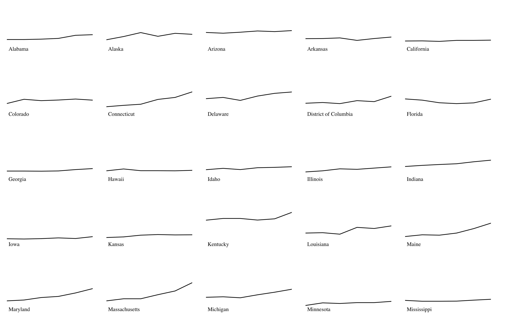

# Opioid Deaths

## Data

- [Deaths by year](https://www.cdc.gov/drugoverdose/data/statedeaths.html)
- [Summary](https://www.cdc.gov/drugoverdose/data/analysis.html)
- ICD-10 Death Codes: X40–X44, X60–X64, X85, and Y10–Y14.

### Notes

- 91 Americans die every day from an opioid overdose.
- The majority of drug overdose deaths (more than six out of ten) involve an opioid.
- Since 1999, the number of overdose deaths involving opioids (including prescription opioids and heroin) quadrupled.
- From 2000 to 2015 more than half a million people died from drug overdoses.
- Types:
  - Prescription. Common types are oxycodone (OxyContin), hydrocodone (Vicodin), morphine, and methadone
  - Fentanyl – Pharmaceutical fentanyl is a synthetic opioid pain medication, approved for treating severe pain, typically advanced cancer pain. It is 50 to 100 times more potent than morphine. However, illegally made fentanyl is sold through illegal drug markets for its heroin-like effect, and it is often mixed with heroin and/or cocaine as a combination product.
  - Heroin – An illegal, highly addictive opioid drug processed from morphine.
  - Benzodiazepines – Sometimes called “benzos,” these are sedatives often used to treat anxiety, insomnia, and other conditions. Combining benzodiazepines with opioids increases a person’s risk of overdose and death.

## Influences

- [Ycombinator stories](https://news.ycombinator.com/item?id=15657523)
- [Photographers view of the American Opioid Crisis - New Yorker](https://www.newyorker.com/news/news-desk/a-photographers-view-of-the-american-opioid-crisis)
- [Seven Days of Heroin Epidemic - Cincinnati Enquirer](https://www.cincinnati.com/pages/interactives/seven-days-of-heroin-epidemic-cincinnati/)

## Goals

- Exploration
- Knowledge

## Ideas

 **51 line charts**

In [51 lines/index.html](51 lines/index.html)

- One for each state
- Right now they will have three datapoints: 2013, 2014, and 2015.
- Upward sloping lines will be red, downward green. (decrease bad, increase good)

Proof of concept:

 **State map**

- Transition from year to year, colors showing severity
- Hover tells more info

 **Pill Bottle filling up**

- Shows summary for US
- Yearly transtions

 **Pills**

- Landing page
- Each one represents a death in the last X years
- A la [NYTimes Immigrants](https://www.nytimes.com/interactive/2016/11/29/us/trump-unauthorized-immigrants.html)

 **Bump Chart**

- Add state glyphs next to each label
- Add rates
- Add single years
- quick and dirty test from [http://app.rawgraphs.io](http://app.rawgraphs.io)

  

   **Rate change line change chart**

  

## Tools

- [State font icons](https://github.com/propublica/stateface)
- [Color brewer for maps](http://colorbrewer2.org/#type=sequential&scheme=YlOrRd&n=5)
- [Scrollytelling](https://pudding.cool/process/how-to-implement-scrollytelling/)
